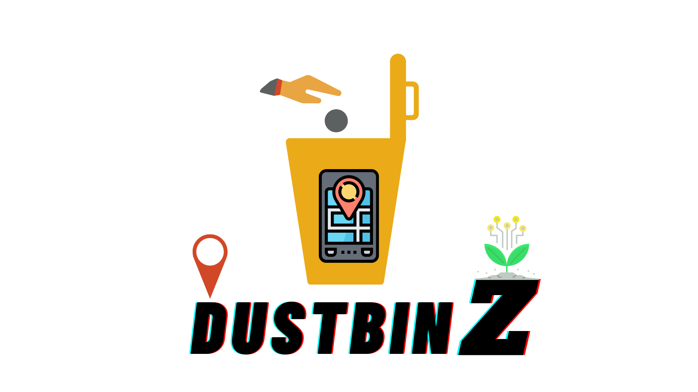

<h1 align="center"> <ins>DUSTBINZ-WebSite</ins> </h1>
<h3 align="center">Get The Dustbin Near You In One Finger Tap</h3>

  

## About The Project

An Application towards a clean environment by tracking the nearest Dustbin for you.

## Technologies Used

- React JS
- React Native
- Vanilla Javascript
- CSS
- Html 5
- Node

## Contributing

Contributions are what make the open source community such an amazing place to be learn, inspire, and create. Any contributions you make are **greatly appreciated**.

1. Fork the Project
2. Create your Feature Branch (`git checkout -b feature`)
3. Commit your Changes (`git commit -m 'Added some Feature or Tool'`)
4. Push to the Branch (`git push origin feature`)
5. Open a Pull Request

## 📜License

Distributed under the MIT License. See `LICENSE` for more information.
